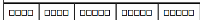
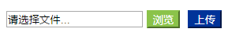

# Solutions-for-working-problem
记录一些工作中遇到的问题及解决方案

#### 2017-05-10
使用kendo将页面元素导出为pdf时中文乱码问题




解决方案：用微软雅黑替换kendo/styles/fonts/DejaVu下的DejaVuSans.ttf和DejaVuSans-Bold.ttf字体，同时保证被导出的元素含有字体样式（继承自bodyH或自身添加）

[kendo导出pdf地址](http://docs.telerik.com/kendo-ui/framework/drawing/drawing-dom#configuration-Custom)

[PDF怎么支持中文](http://blog.csdn.net/miyawang21/article/details/59482889)

#### 2017-05-10
from表单制作文件上传修改input[type="file"]默认样式


解决方案：设置input opacity:0,并且添加一个覆盖层```<input type="text" class="filename" readonly/>``
`